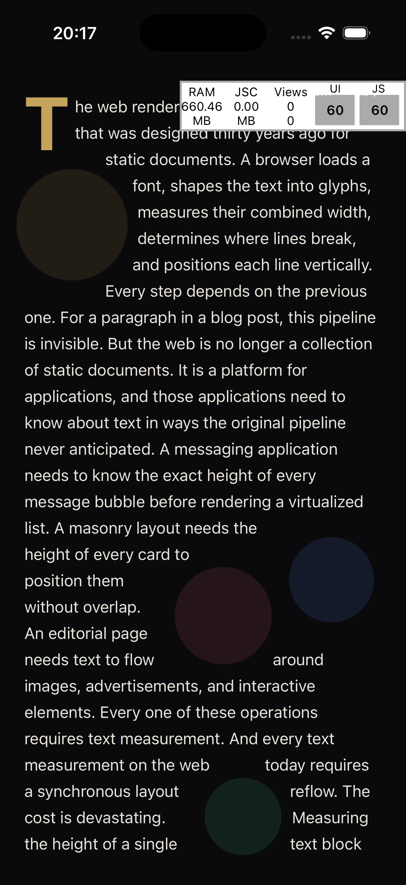
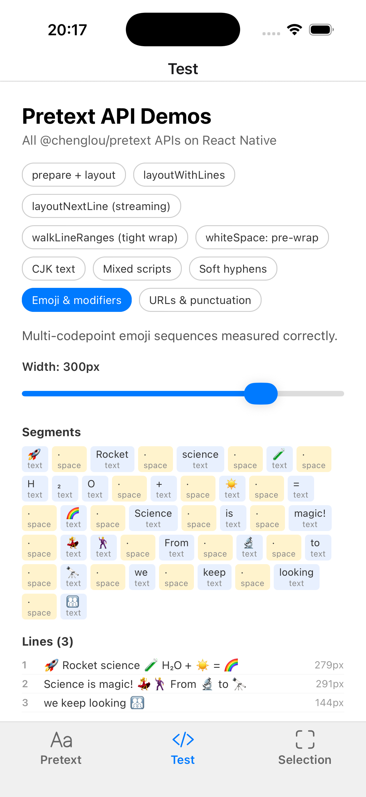
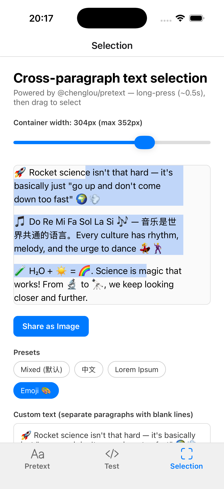

# rn-pretext

[@chenglou/pretext](https://github.com/chenglou/pretext) for React Native — multiline text measurement and layout without the DOM, using platform-native measurement (CoreText / Android Paint) for zero drift with `<Text>`.

## Packages

- **[rn-pretext](./rn-pretext/)** — Polyfill + re-export of `@chenglou/pretext`
- **[expo-text-measure](./expo-text-measure/)** — Expo Module for synchronous native text measurement
- **[playground](./playground/)** — Demo app (editorial layout, bubbles, masonry, text selection, etc.)

## Screenshots

| Editorial Engine | API Demos | Text Selection |
|:---:|:---:|:---:|
|  |  |  |

## Dev

```bash
bun install
bun start        # playground: expo start
bun run ios      # playground: expo run:ios
```
